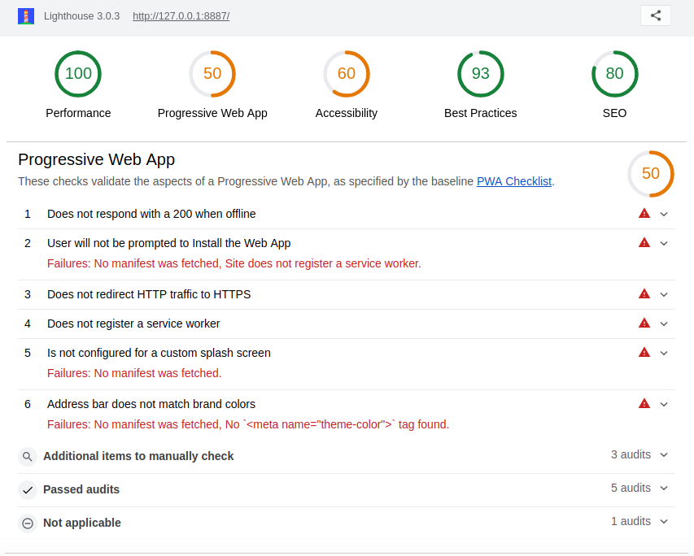

# TALLER 1 y 3: Progressive Web Apps (PWA) / Headless Testing.

## Taller 3 :: Google Lighthouse
### Métricas personalizadas:
* Latencia en la visualización de la 1er tarjeta.
* Latencia en la consulta del API.

Reporte: [consultar](lighthouse/localhost_2018-08-29_11-56-52.report.html).

## Taller 1
## Auditoría INICIAL con Google Lighthouse

## Auditoría FINAL con Google Lighthouse

## Despliegue en FIREBASE

